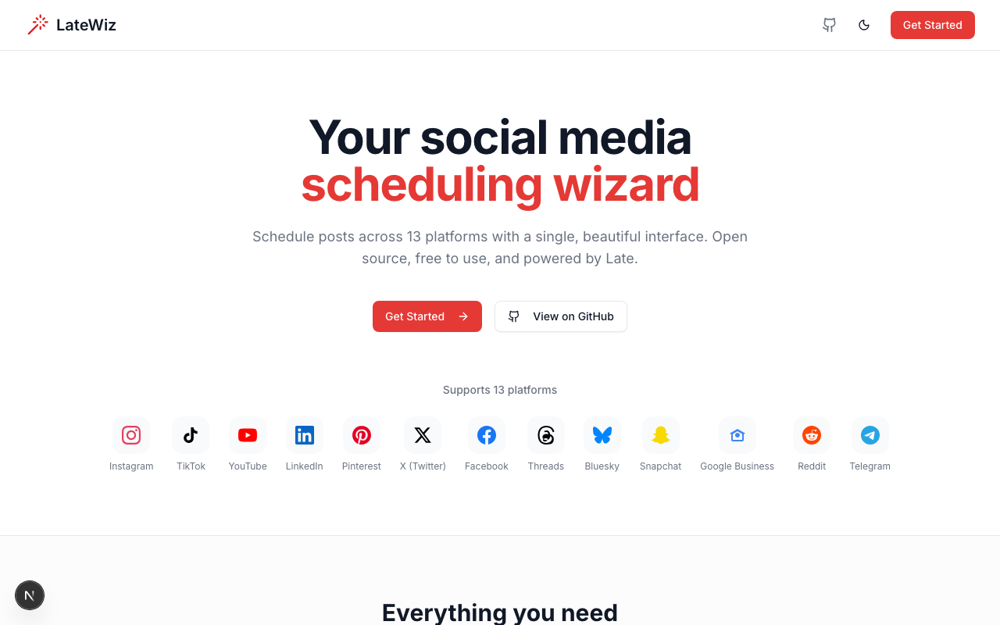

# LateWiz

**Your social media scheduling wizard.** Schedule posts across 13 platforms with a single, beautiful interface.

<a href="https://vercel.com/new/clone?repository-url=https%3A%2F%2Fgithub.com%2Fgetlate-dev%2Flatewiz&env=LATE_API_KEY&envDescription=Your%20Late%20API%20key%20from%20getlate.dev&envLink=https%3A%2F%2Fgetlate.dev%2Fdashboard%2Fapi-keys&project-name=latewiz&repository-name=latewiz"></a>
<a href="https://railway.app/template/latewiz?referralCode=late"></a>



## Features

- **13 Platforms** - Instagram, TikTok, YouTube, LinkedIn, Pinterest, X/Twitter, Facebook, Threads, Bluesky, Snapchat, Google Business, Reddit, Telegram
- **Visual Calendar** - See all your scheduled content at a glance
- **Smart Queue** - Set up posting times and let LateWiz handle the rest
- **Media Uploads** - Support for images and videos up to 5GB
- **Platform-Specific Settings** - TikTok privacy, YouTube titles, Pinterest boards, and more
- **Dark Mode** - Easy on the eyes, day or night
- **Open Source** - MIT licensed, self-host anywhere

## Quick Start

### Option 1: One-Click Deploy (Recommended)

Click the "Deploy with Vercel" button above, enter your [Late API key](https://getlate.dev/dashboard/api-keys), and you're done.

### Option 2: Local Development

```bash
# Clone the repository
git clone https://github.com/getlate-dev/latewiz.git
cd latewiz

# Install dependencies
npm install

# Copy environment variables
cp .env.example .env.local

# Add your Late API key to .env.local
# LATE_API_KEY=sk_...

# Start the development server
npm run dev
```

Open [http://localhost:3000](http://localhost:3000) in your browser.

### Option 3: Docker

```bash
# Using Docker Compose
docker-compose up -d

# Or build and run manually
docker build -t latewiz .
docker run -p 3000:3000 -e LATE_API_KEY=sk_... latewiz
```

## Configuration

| Variable | Required | Description |
|----------|----------|-------------|
| `LATE_API_KEY` | Yes* | Your Late API key. Get one at [getlate.dev](https://getlate.dev/dashboard/api-keys) |
| `NEXT_PUBLIC_APP_URL` | No | Your app's public URL (for OAuth callbacks) |
| `NEXT_PUBLIC_APP_NAME` | No | Custom app name (default: LateWiz) |

*If not set, users will be prompted to enter their own API key.

## Getting a Late API Key

1. Sign up at [getlate.dev](https://getlate.dev)
2. Go to [API Keys](https://getlate.dev/dashboard/api-keys)
3. Create a new API key
4. Copy the key (starts with `sk_`)

## Tech Stack

- [Next.js 14](https://nextjs.org/) - React framework
- [Tailwind CSS](https://tailwindcss.com/) - Styling
- [shadcn/ui](https://ui.shadcn.com/) - UI components
- [TanStack Query](https://tanstack.com/query) - Data fetching
- [Zustand](https://zustand-demo.pmnd.rs/) - State management
- [Late Node SDK](https://github.com/getlate-dev/late-node) - API client

## Project Structure

```
latewiz/
├── src/
│   ├── app/                    # Next.js App Router
│   │   ├── (dashboard)/        # Dashboard routes
│   │   │   ├── compose/        # Post composer
│   │   │   ├── calendar/       # Calendar view
│   │   │   ├── accounts/       # Connected accounts
│   │   │   ├── queue/          # Queue management
│   │   │   └── settings/       # User settings
│   │   └── callback/           # OAuth callbacks
│   ├── components/
│   │   ├── ui/                 # shadcn/ui components
│   │   ├── composer/           # Post composer components
│   │   ├── calendar/           # Calendar components
│   │   └── shared/             # Shared components
│   ├── lib/
│   │   └── late-api/           # Late API utilities
│   └── stores/                 # Zustand stores
├── docs/                       # Documentation
└── docker/                     # Docker configuration
```

## Contributing

We welcome contributions! Please see [CONTRIBUTING.md](./CONTRIBUTING.md) for guidelines.

### Development

```bash
# Install dependencies
npm install

# Run development server
npm run dev

# Run linting
npm run lint

# Type check
npx tsc --noEmit
```

## Support

- [Late Documentation](https://docs.getlate.dev)
- [Late API Reference](https://docs.getlate.dev/api)
- [GitHub Issues](https://github.com/getlate-dev/latewiz/issues)
- [Discord Community](https://discord.gg/late)

## License

MIT License - see [LICENSE](./LICENSE) for details.

---

Built with [Late](https://getlate.dev) - The Social Media Scheduling API
